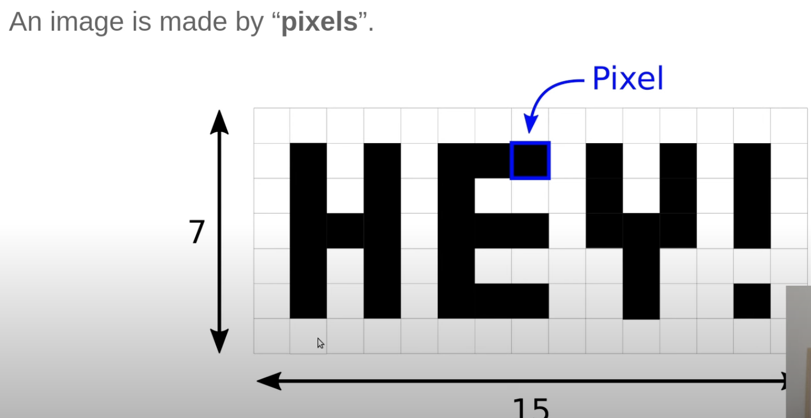
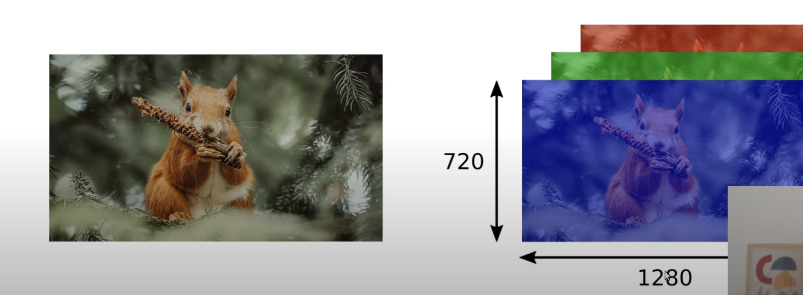
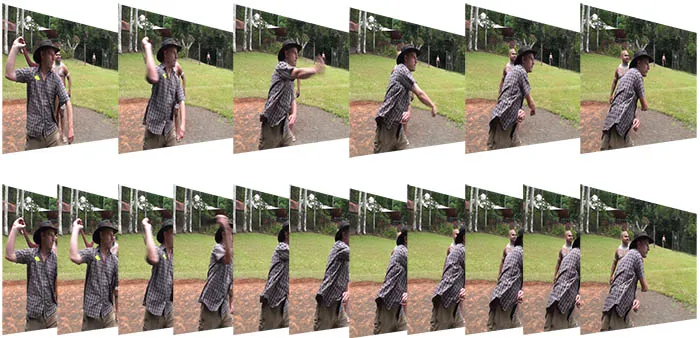

# Introduction to OpenCV python

## Images 🎑

- Images are simply numpy arrays.

---

- These array contain numbers that indicate the color/brightness of the images in different channels.

---

## Videos 🎥

- Videos are simply a collection of images which are sequentially swapped at some speed (let's say 30 fps, i.e., 30 images per second), and give illusion of a video.

