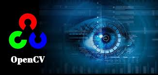
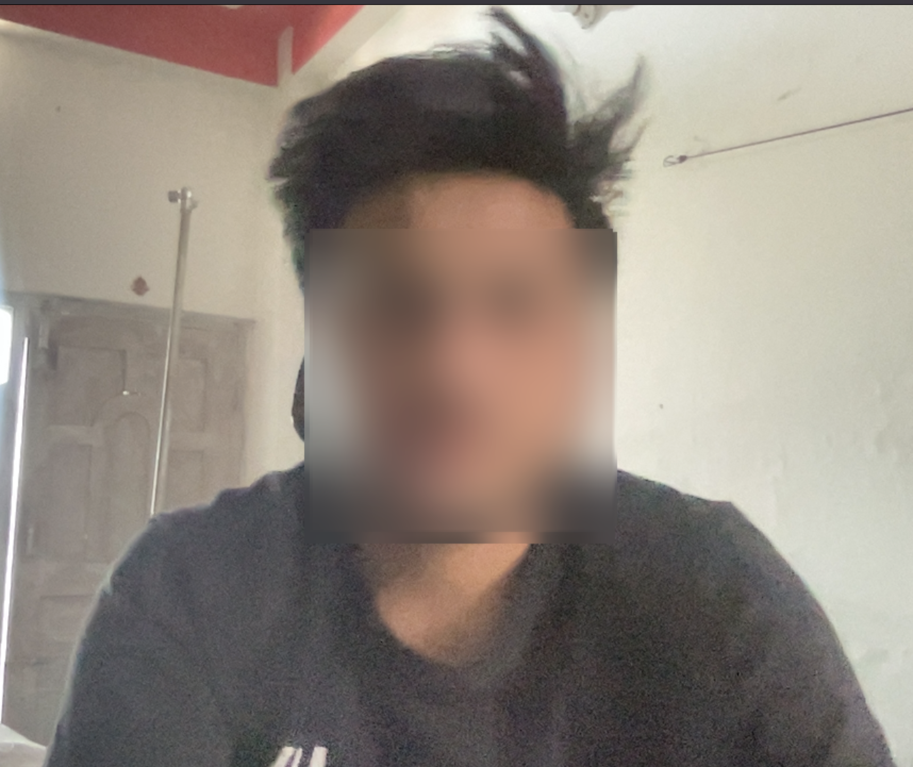

# Open-CV codes 😎



- [OpenCV-python documentation](https://opencv24-python-tutorials.readthedocs.io/en/latest/py_tutorials/py_tutorials.html)

## Contents

1. [What are images & videos](./01-what-are-images-and-videos/)
2. [IO: Image, Video & Webcam](./02-io-image-video-webcam/) ✅
3. [Crop, flip & Resize image](./03-resize-crop-and-flip/) ✅
4. [Colorspaces](./04-colorspace/)
5. [Blurring](./05-blurring/)
6. [Global & Adaptive threshold](./06-global-and-adaptive-threshold/)
7. [Edge detection](./07-edge-detection/)
8. [Drawing lines, circle, rectangles, text using OpenCV](./08-drawing-using-opencv/) ✅
9. [OpenCV events](./09-opencv-events/) ✅
10. [Project: Blur my face](./project-Blur-My-Face/)



---

## Important

- IO: Image, video & webcam
- crop & resize
- drawing lines, circles, rectangles, and writing text on image
- OpenCV events

```diff
+ Be sure to checkout MediaPipe: https://developers.google.com/mediapipe

- MediaPipe (from google) can handle:
    - Object detection
    - Object segmentation
    - Gesture recognition
    - face detection
    - pose landmark detection
    - and much more.

```
